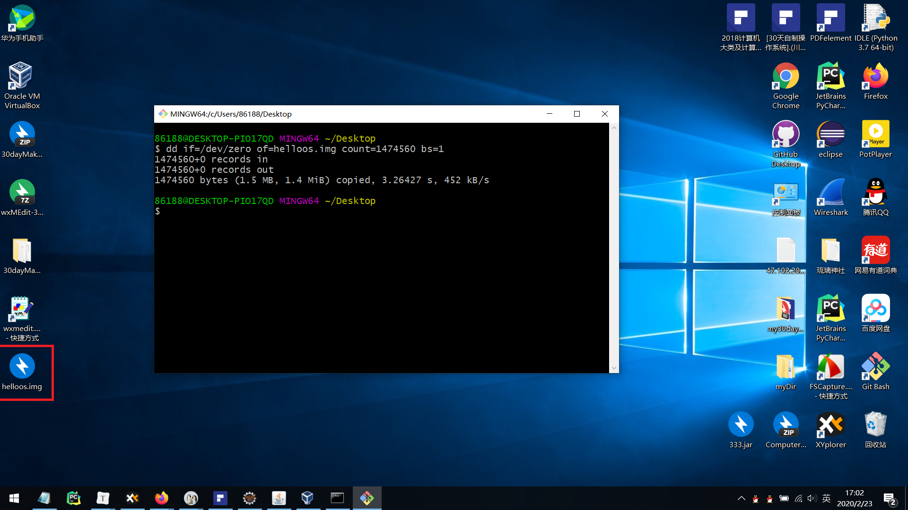
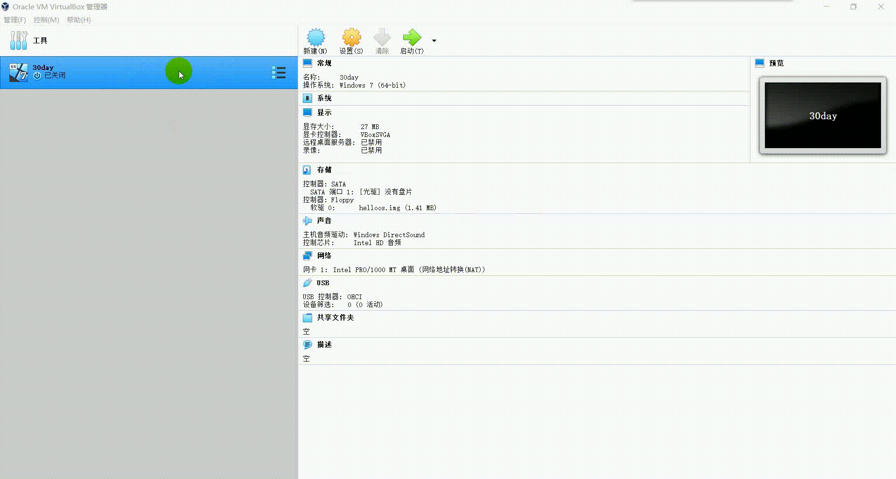

第1天：从计算机结构到汇编程序入门

## 工具

- cn_windows_10_consumer_editions_version_1809_updated_jan_2019_x64_dvd_34b4d4fb（简称win10）
- [VirtualBox-6.1.4-136177-Win.exe](https://www.virtualbox.org/)
- [wxMEdit-3.1-win32-bin.7z](http://wxmedit.github.io/)(非必须，请往下看)
- [Git-2.24.1.2-64-bit.exe](https://git-scm.com/)(非必须，请往下看)

## 软盘映像文件：hellos.img

### 方法一

如果你不想搞这么多，直接到第一天那个文件夹那里，找到 *helloos.img*  文件，就可以直接用了，这一步下的东西都不用看^_^。

### 方法二

如果你下载了 Git Bush (包含在 Git 中)，就可以使用 Git Bush 生成 *helloos.img*。（其实名字无所谓，只是书里叫 helloos.img，我也跟着这么叫罢了。）

#### 创建 全是 0 的 *hellos.img* 文件

随便找个地方（这里我选桌面），右键单击，然后点击 `Git Bash Here`  然后执行下面的命令：

```
dd if=/dev/zero of=helloos.img count=1474560 bs=1
```

执行完这一步，你会在桌面看到一个 *hellos.img* 文件。



#### 编辑 *hellos.img* 文件

这里用二进制编辑器进行编辑，我用 *wxMEdit* ，这里一共有三处地方需要编辑：

##### 第一处

```
EB4E9048454C4C4F49504C000201010002E000400BF009001200020000000000400B0000000029FFFFFFFF48454C4C4F2D4F532020204641543132202020000000000000000000000000000000000000B800008ED0BC007C8ED88EC0BE747C8A0483C6013C007409B40EBB0F00CD10EBEEF4EBFD0A0A68656C6C6F2C20776F726C640A
```


##### 第二处

```
55AAFFF0
```


##### 第三处

```
F0FFFF
```


### 新建一个系统


#### 取名选位置

其他东西无所谓，因为你不会真的把这个东西装到你的电脑里。


#### 内存大小

给 64M 应该够了。（书上建议给100M左右，我这里已经给了，以后重做再说）


#### 不要硬盘


忽略警告，直接点继续就行


#### 完成创建

看到下图说明你完成了创建，我创建的名字是 30day，下图电脑预览的也是 30day。


### 导入软盘映像文件

#### 设置

#### 选择 **I82078(Flppy)**


#### 添加虚拟软驱


#### 添加虚拟磁盘


选择刚才制作好的 *hellos.img* 文件，之后一路确定即可。


### 双击运行

看到 **hello world** ，打完收工！

