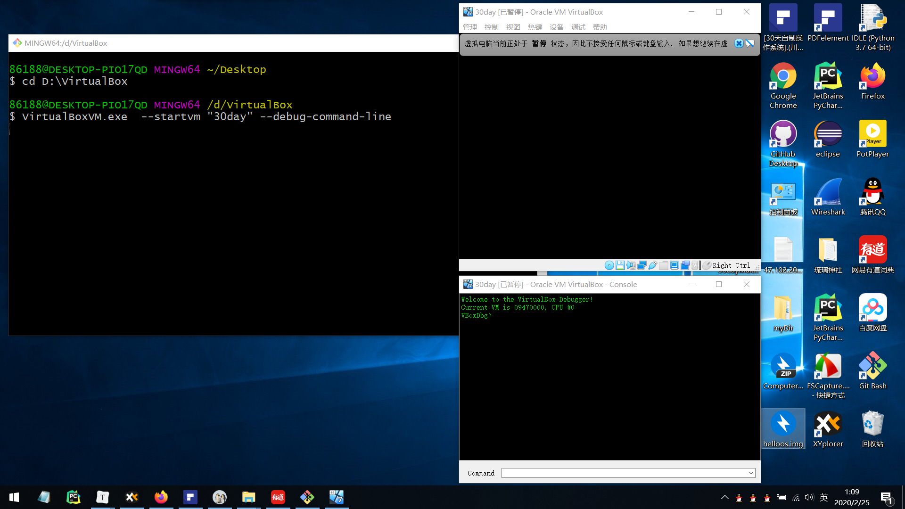

# 第2天：汇编语言学习与Makefile入门

## 开启 debug

#### 打开 cd 到 virtualbox 的安装目录

我这里的安装目录是 *D:\VirtualBox*

```
cd D:\VirtualBox
```

#### 开启 debug

*30day* 是我虚拟机的名字，把名字替换成需要的虚拟机名字即可，其他东西不要动。

```
VirtualBoxVM.exe  --startvm "30day" --debug-command-line
```



**参考**：[如何使用VirtualBox的内置调试器VBoxDBG](https://blog.csdn.net/mzjmzjmzjmzj/article/details/89567030?depth_1-utm_source=distribute.pc_relevant.none-task&utm_source=distribute.pc_relevant.none-task)

## 开始操作

### 查看寄存器

没什么意思，就看一下寄存器的状态。

```
r
```


### 断点到程序入口

打个断点，别让它运行过头了，如果不打这个断点，*hello,world* 会直接出现。这个断点打在程序的入口 *7c00* .

```
ba x 1 7c00
```


### 开始运行

此时，虚拟机处于暂停状态，先让它运行起来 **控制->暂停**，点掉即可。


查看当前程序，可以看到我们已经到了程序入口。仔细对照一下，可以发现：EB4E904845... ... 这些东西就是我们前面软盘里的内容。

```
u
```


### 断点到打出字符之后

在屏幕上打个字符会产生中断、调用例程（我把例程粗略地看成函数），它调用例程中间有很多操作，我们先不关心这些东西。先打个断点，运行到断点处以跳过例程。我们把断点设置在 *7c6f*  这里，因为这里就是调用例程之后的那一条指令。

```
ba  x 1 7c6f
```


### 打印字符

运行！下面每打一个 g 指令就会出一个字符！如果你没有看到字符，不要心急，前面几个是换行符，看不出来，执行了第四个 g 之后，你就会看到字字符 h 了。之后，你在多执行几次 g 指令，就可以看到完整的 *hello,world* 。

```
g
```

